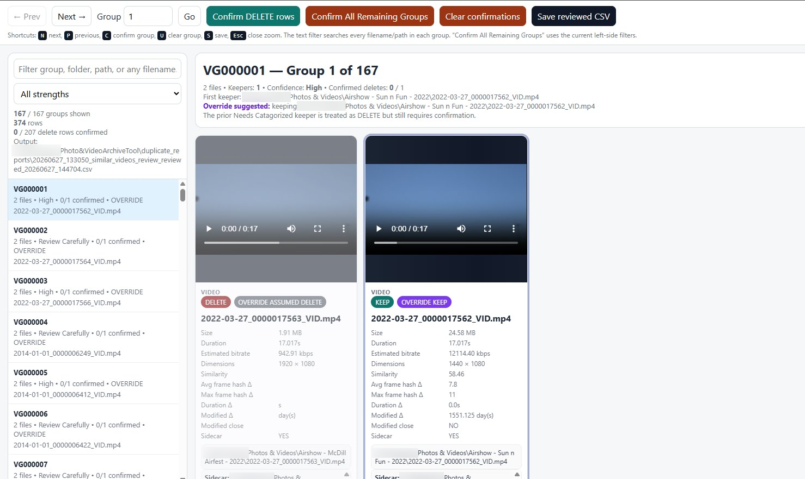

# Photo & Video Archive Tools

Windows-focused Python/PowerShell tools for cleaning up a large photo/video archive.

I made this because I had about 40k photos/videos to work through and did not find a public tool that felt modern enough for what I needed. I found older options like ImageHash-based scripts and VisiPics, but they were not the right fit for my archive. Basic ImageHash settings also missed a lot of what I needed to catch.

So I vibe-coded this with generative AI help and used it for my own cleanup.

Free to use. Fork it. Change it. Break it. Fix it with AI. I do not plan to support it.

Also, use this at your own choice and risk. I take no responsibility if it deletes the wrong file, corrupts metadata, breaks your workflow, or somehow sets your PC on fire.



## Help guide

[Open the help guide](https://klownicle.github.io/photo-video-archive-tools/)

GitHub shows HTML files as source code when opened from the normal repo file browser. The link above is the rendered GitHub Pages version.

Source files:

- [`docs/index.html`](docs/index.html)
- [`docs/Photo_Video_Archive_Tools_Help.html`](docs/Photo_Video_Archive_Tools_Help.html)

## What this does

The tools are meant to help with:

- renaming photos/videos into stable archive-safe filenames
- reviewing files with missing dates
- using folder context to deal with leftover undated files
- finding image/video duplicates and near-duplicates
- visually reviewing duplicate groups before deleting anything
- processing only explicitly confirmed delete rows
- deleting matching XMP sidecars when confirmed duplicate media is deleted
- removing orphaned XMP sidecars after cleanup
- reusing duplicate caches after a root/path rename with an optional filename-only cache fallback
- creating/updating image and video XMP sidecars
- correcting image metadata and folder-based tags
- optionally writing Windows Explorer tags for images/videos where supported

This was built around a real cleanup workflow, not as a general-purpose commercial app.

## The de-dupe part

The de-dupe workflow is the main reason this project exists.

I was not just trying to find exact duplicate files. Exact hash matching is easy, but it misses a lot of real archive junk. My archive had renamed files, resized images, recompressed videos, cloud exports, phone exports, old camera folders, repeated filenames, and random copies spread across folders.

The workflow is intentionally split into three steps:

1. Find likely duplicate groups.
2. Review them visually in a local browser UI.
3. Delete only rows that were explicitly confirmed.

The delete processors only act on rows where both values are set:

```text
SuggestedAction = DELETE
ConfirmDelete = CONFIRM
```

So the scripts can suggest deletes, but they do not blindly delete them. You review, confirm, save the CSV, then process the confirmed rows.

## Image duplicate logic

The image duplicate finder compares image content, not just filenames or exact file hashes.

It can help catch things like:

- the same image renamed into different folders
- resized copies
- recompressed copies
- phone/cloud export duplicates
- visually identical or near-identical files with different sizes

The image workflow uses:

- SHA-256 for exact byte-for-byte duplicates
- perceptual dHash for visual similarity
- average hash / aHash as another visual signal
- aspect-ratio checks
- average color distance checks
- BK-tree indexing so searches are not just a giant slow compare-everything-to-everything loop
- SQLite caching so future runs do not re-hash unchanged images
- optional filename-only cache fallback for archive root/path changes

The suggested image keeper generally favors:

1. higher resolution / pixel count
2. larger file size
3. preferred extension order
4. shorter path
5. alphabetical path as a final tie-breaker

It still needs review. That is the point of the browser reviewer.

## Video duplicate logic

Video de-dupe is harder than image de-dupe.

The same video can have a different file size, codec, bitrate, container, resolution, and modified date. A basic file hash is useless for that.

The video finder uses FFprobe and FFmpeg to compare the actual video content:

- FFprobe reads duration, width, height, and stream info
- FFmpeg samples frames from multiple points in the video
- each sampled frame gets a 64-bit perceptual hash
- frame hash distances are compared
- duration has to be close enough
- Date Modified is used only as a weak audit/helper signal
- estimated bitrate is used as a quality/preservation signal
- SQLite caching avoids re-sampling unchanged videos every run
- optional filename-only cache fallback can reuse old cache rows after a root/path rename
- `-Workers` can parallelize video cache misses, but use lower values than image hashing because each worker can launch FFmpeg/FFprobe

This was useful for videos that were exported, compressed, re-encoded, resized, or renamed but were still basically the same clip.

## Video keeper logic

For videos, the keeper is not simply “highest resolution wins.”

That mattered because a tiny heavily compressed 1080p file can be worse than a larger lower-resolution copy. So the video logic tries to prefer preservation quality, not just dimensions.

The current video keeper preference is roughly:

1. if everything is in the same folder and the files are the same size, prefer the older Date Modified file
2. prefer an already archive-renamed video filename
3. prefer a file with a matching XMP sidecar
4. prefer higher estimated bitrate / larger effective file size
5. prefer higher resolution
6. use shorter path and alphabetical path as final tie-breakers

The reviewer can also override the suggested keeper without rerunning the expensive video analysis. For example, if the suggested keeper is still sitting in a temporary `Needs Categorized` folder, but an equal-or-better copy exists in a real album folder, the reviewer can suggest keeping the better placed file instead.


## Cache reuse after archive root or folder changes

Both duplicate finders normally use strict cache validation so stale cache rows are not reused accidentally. A normal direct cache hit uses the current full path plus the script's normal validation rules.

If the archive root was renamed or moved, the full paths stored in the SQLite cache may no longer match. Use this optional fallback only when your archive filenames are stable and unique:

```powershell
python .\Find-SimilarImages-ReviewDelete.py `
  -Root "D:\MediaArchive\Photos and Videos" `
  -IgnoreFullRootComparison `
  -Workers 16

python .\Find-SimilarVideos-ReviewDelete.py `
  -Root "D:\MediaArchive\Photos and Videos" `
  -IgnoreFullRootComparison `
  -Workers 3
```

`-IgnoreFullRootComparison` still tries the direct full-path cache lookup first. If that misses, it falls back to a filename-only cache lookup. In that fallback mode it intentionally ignores the old root path, parent folders, file size, and Date Modified. The current live file path is still written to the new reports.

This is useful after a root-folder rename such as:

```text
D:\Old Archive Root\2023-08-20_0000000001_IMG.jpg
D:\MediaArchive\Photos and Videos\2023-08-20_0000000001_IMG.jpg
```

Do not use this switch on archives where the same filename can represent different media files in different folders.

For troubleshooting cache behavior, add:

```powershell
-CacheDebug 25
```

That prints the first cache decisions so you can confirm whether hits are direct hits, filename fallback hits, or misses. Do not use `-RebuildCache` unless you intentionally want to re-hash or re-sample everything.

## Duplicate processing and XMP sidecars

The image and video duplicate processors send confirmed deletes to the Recycle Bin by default. They also delete the matching XMP sidecar by default:

```text
media_file.ext
media_file.ext.xmp
```

Use `-NoSidecars` only when you intentionally want to delete the media file but leave the sidecar behind.

If you already deleted media before sidecar cleanup existed, use the orphan cleanup helper:

```powershell
.\Remove-OrphanedXmpSidecars.ps1 `
  -Root "D:\MediaArchive\Photos and Videos" `
  -WhatIf

.\Remove-OrphanedXmpSidecars.ps1 `
  -Root "D:\MediaArchive\Photos and Videos"
```

The orphan cleanup script looks for `media_file.ext.xmp` sidecars where `media_file.ext` no longer exists, writes a report, and sends orphaned sidecars to the Recycle Bin by default.

## Included files

- `Rename-PhotosVideos-ExifTool.py`
- `Correct-ImageVideoMetadataFromFilename.py`
- `Find-SimilarImages-ReviewDelete.py`
- `Find-SimilarVideos-ReviewDelete.py`
- `Review-SimilarFiles.py`
- `Install-FFmpeg-ForArchiveTool.ps1`
- `Remove-OrphanedXmpSidecars.ps1`
- `requirements.txt`
- `docs/Photo_Video_Archive_Tools_Help.html`

## Requirements

Install Python requirements:

```powershell
python -m pip install -r requirements.txt
```

Some Windows Explorer tag operations require `pywin32`:

```powershell
python -m pip install pywin32
```

### ExifTool

ExifTool is required for rename and embedded image metadata operations. It can be skipped for sidecar-only and Windows-tag-only corrective passes by using `-SkipExifTool`.

Get it from the official ExifTool site:

```text
https://exiftool.org/
```

Recommended Windows placement for these scripts:

```text
C:\Tools\ExifTool\exiftool.exe
```

Typical setup:

1. Download the Windows executable package from ExifTool.
2. Extract it.
3. Rename `exiftool(-k).exe` to `exiftool.exe` if needed.
4. Place it at `C:\Tools\ExifTool\exiftool.exe`.
5. Verify it:

```powershell
& "C:\Tools\ExifTool\exiftool.exe" -ver
```

If you put it somewhere else, pass the path with `-ExifTool`.

### FFmpeg / FFprobe

FFmpeg and FFprobe are required for video duplicate detection.

This repo includes a helper installer:

```powershell
.\Install-FFmpeg-ForArchiveTool.ps1 -Force
```

That should place FFmpeg locally under the tool folder:

```text
.\ffmpeg\bin\ffmpeg.exe
.\ffmpeg\bin\ffprobe.exe
```

The video duplicate finder can auto-detect that local folder.

Verify it:

```powershell
.\ffmpeg\bin\ffmpeg.exe -version
.\ffmpeg\bin\ffprobe.exe -version
```

## Corrective metadata, tags, and sidecars

`Correct-ImageVideoMetadataFromFilename.py` is the final corrective pass after the archive is renamed and mostly organized.

It can:

- set missing image Date Taken from the archive filename
- create image XMP sidecars
- create video XMP sidecars
- update existing image/video sidecars when explicitly forced
- write the current parent-folder name as the folder tag
- optionally write Windows Explorer Tags / `System.Keywords` for images and videos
- automatically apply a Windows Explorer tag fallback for selected video files because embedded video keyword writes are not handled by ExifTool in this workflow
- reprocess rows from a prior corrective report with `-ReprocessReportCsv`
- skip ExifTool when you only want sidecars and/or Windows Tags

The sidecar naming format is:

```text
media_file.ext.xmp
```

Examples:

```text
2022-04-09_0000000001_IMG.jpg
2022-04-09_0000000001_IMG.jpg.xmp

2022-04-09_0000000002_VID.mp4
2022-04-09_0000000002_VID.mp4.xmp
```

The normal rerun behavior is intentionally conservative: media files that already have `media_file.ext.xmp` are treated as already processed and skipped. This prevents a full `-Root` rerun from forcing ExifTool to read/write the whole archive when you only added a new batch of files.

Normal rerun after adding new files:

```powershell
python .\Correct-ImageVideoMetadataFromFilename.py `
  -Root "D:\MediaArchive\Photos and Videos" `
  -WhatIf

python .\Correct-ImageVideoMetadataFromFilename.py `
  -Root "D:\MediaArchive\Photos and Videos"
```

That processes renamed image/video files that do not already have a sidecar. For new images, it can create the sidecar, add the parent-folder tag, and set embedded Date Taken only if it is missing. For new videos, it creates the sidecar with the filename date and parent-folder tag, and it also attempts to add the parent-folder tag to the video file's Windows Explorer Tags / `System.Keywords` field. This video Windows tag fallback is part of the normal selected-video processing path because ExifTool is not used for embedded video keyword/tag writes in this workflow.

By default, embedded image writes preserve the filesystem Date Modified timestamp. Use `-UpdateFileModifiedTime` only if you intentionally want ExifTool writes to update the filesystem modified time.

Use `-Force` when you intentionally want to reprocess sidecar-backed files:

```powershell
# Re-evaluate existing sidecar-backed files
python .\Correct-ImageVideoMetadataFromFilename.py `
  -Root "D:\MediaArchive\Photos and Videos" `
  -Force `
  -WhatIf

# Rewrite existing sidecars after folder/tag changes
python .\Correct-ImageVideoMetadataFromFilename.py `
  -Root "D:\MediaArchive\Photos and Videos" `
  -Force `
  -UpdateExistingSidecars `
  -WhatIf

# Full reset pass after major reorganization
python .\Correct-ImageVideoMetadataFromFilename.py `
  -Root "D:\MediaArchive\Photos and Videos" `
  -Force `
  -ResetExistingTags `
  -WhatIf
```

Use `-ReprocessReportCsv` when you want to apply a newly added corrective action to the exact files listed in a prior corrective report. This bypasses the normal root scan and the existing-sidecar skip for those report rows. It is useful when an older run already created sidecars but missed a later-added action such as video Windows tag fallback:

```powershell
python .\Correct-ImageVideoMetadataFromFilename.py `
  -ReprocessReportCsv "D:\MediaArchive\Photos and Videos\20260628_020418_corrective_image_video_metadata_report.csv" `
  -VideosOnly `
  -WhatIf

python .\Correct-ImageVideoMetadataFromFilename.py `
  -ReprocessReportCsv "D:\MediaArchive\Photos and Videos\20260628_020418_corrective_image_video_metadata_report.csv" `
  -VideosOnly
```

Useful targeted modes:

```powershell
# Create missing sidecars without embedded image ExifTool reads/writes
python .\Correct-ImageVideoMetadataFromFilename.py `
  -Root "D:\MediaArchive\Photos and Videos" `
  -SkipExifTool `
  -WhatIf

# Sidecars plus Windows Explorer tags for only new/unprocessed files
python .\Correct-ImageVideoMetadataFromFilename.py `
  -Root "D:\MediaArchive\Photos and Videos" `
  -SkipExifTool `
  -SetWindowsTags `
  -WhatIf
```

`-SetWindowsTags` applies to files selected for processing. During a normal `-Root` rerun, existing sidecar-backed files are still skipped unless `-Force` is used. This is intentional so a tag-only maintenance command does not unexpectedly touch the completed archive.

Remove `-WhatIf` only after the report looks right.


## Basic workflow

1. Rename media into stable archive-safe names.
2. Review unresolved missing-date items.
3. Use CatchUp only after undated files are in meaningful folders.
4. Find duplicate images/videos.
5. Review duplicate groups in `Review-SimilarFiles.py`.
6. Process confirmed deletes with `-WhatIf` first. Matching XMP sidecars are removed by default.
7. Run orphaned XMP cleanup if older deletes left sidecars behind.
8. Run the corrective metadata/tag/sidecar pass after the folder structure is stable. Use the default rerun for new files, or `-Force` for intentional full reprocessing.

## Safety rule

The duplicate processors only delete rows where:

```text
SuggestedAction = DELETE
ConfirmDelete = CONFIRM
```

Always run rename, delete, sidecar cleanup, and metadata operations with `-WhatIf` first.

Also: do not run this against your only copy of anything important. Test on a copied folder first.

## Maintenance status

This repository is shared as-is.

I do not plan to actively maintain this project, provide support, or fix reported issues. If it helps you, great. If it does not, fork it and change it.

Issues and pull requests may not be reviewed.

## License

See `LICENSE`.

## No support

See `NO_SUPPORT.md`.
